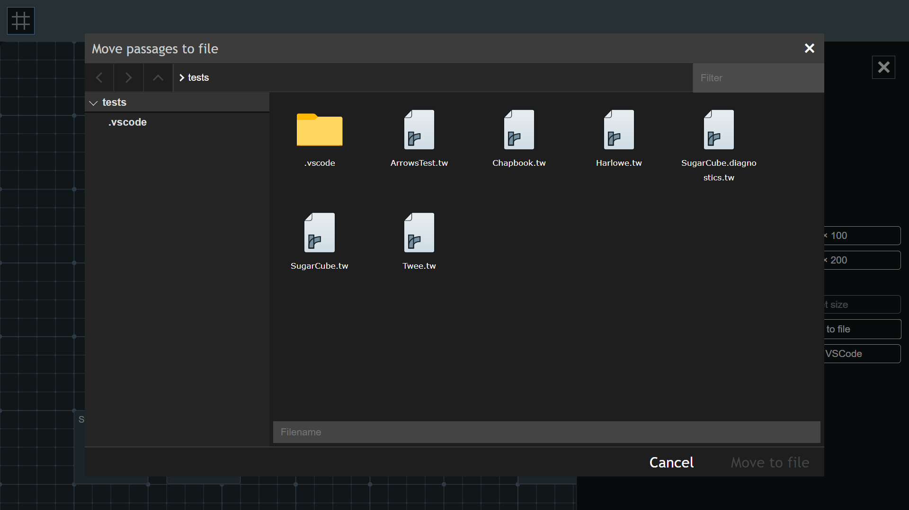

# Changelog

## v0.27.3

Adds:

- Extension process logging under "T3LT (Log)".
- Error handling for file opening during startup which caused it never resolve and move on with further startup functions leading to infinite loading and broken features [Issue #163](https://github.com/cyrusfirheir/twee3-language-tools/issues/163).

## v0.27.0

Adds:

- Debouncing for passage text parsing and diagnostic updates in the `onDidChangeTextDocument` handler. Should hopefully reduce CPU usage when making large edits.
- `twee3LanguageTools.parseText.wait` and `twee3LanguageTools.parseText.maxWait`: Configurations to modify the debounce wait durations.

Changes:

- Diagnostics updater doesn't comb through a document line-by-line anymore. Since that is already done by passage text parsers, results from that are leveraged instead. Should hopefully reduce CPU usage for larger projects.

Updates:

- Engine to Node 20
- Most dependencies have been updated to latest versions

## v0.25.0

Adds:

- Basic definition support for SugarCube 2 macros and widgets (<kbd>Ctrl</kbd> + <kbd>Click</kbd> to go to definition) - [PR #150](https://github.com/cyrusfirheir/twee3-language-tools/pull/150).

## v0.24.0

Adds:

- Light mode for Storymap.
- Passage folding (Thanks to @leahiel - [PR #148](https://github.com/cyrusfirheir/twee3-language-tools/pull/148)).

## v0.23.0

Adds:

- `twee3LanguageTools.storyMap.restoreStoryMapOnLaunch`: Reopens the Story Map on launch if it was open during the last session. Resolves [Issue #145](https://github.com/cyrusfirheir/twee3-language-tools/issues/145).

## v0.22.0

Adds:

- `OnEnterRules` for SugarCube-2, handling indentation for macros. Partially addresses [Issue #144](https://github.com/cyrusfirheir/twee3-language-tools/issues/144).

## v0.21.0

Adds:

- Enums to SugarCube macro definitions ([Issue #139](https://github.com/cyrusfirheir/twee3-language-tools/issues/139) and [PR #141](https://github.com/cyrusfirheir/twee3-language-tools/pull/141)).  
- Setting to customize number of aliases allowed in a single yaml file ([PR #142](https://github.com/cyrusfirheir/twee3-language-tools/pull/142)).

Fixes:

- Performance improvements for large projects ([PR #140](https://github.com/cyrusfirheir/twee3-language-tools/pull/140)).  
- SugarCube macro definition handling ([PR #143](https://github.com/cyrusfirheir/twee3-language-tools/pull/143)).

## v0.20.0

Adds:

- Editor context menu item: `Set passage as story start` sets the currently focused passage in the editor as the start passage. 

## v0.19.4

Fixes:

- Bracket pair definition for angle brackets removed. No more rogue pair coloring for SugarCube 2 macro syntax highlights.

## v0.19.0

Fixes:

- Harlowe 3 syntax highlighting ([PR #120](https://github.com/cyrusfirheir/twee3-language-tools/pull/120)).

## v0.18.3

Fixes:

- Premature closing of the storymap when in webview mode ([Comment on #103](https://github.com/cyrusfirheir/twee3-language-tools/issues/103#issuecomment-1144213162)).
- Sanitizes tags when added from the story map. Resolves [Issue #115](https://github.com/cyrusfirheir/twee3-language-tools/issues/115).
- Fixes saving of changes to tags array from story map.

## v0.18.0

Adds:

- Symbol provider for passages. Resolves [Issue #106](https://github.com/cyrusfirheir/twee3-language-tools/issues/106).

## v0.17.1

- Webview Story Map now auto opens to a side in a locked editor group. Resolves [Issue #103](https://github.com/cyrusfirheir/twee3-language-tools/issues/103).

## v0.17.0

Adds:

- Webview version of Story Map, which is now the default mode. Change using the `twee3LanguageTools.storyMap.windowType` setting.

## v0.16.3

Merges [PR #96](https://github.com/cyrusfirheir/twee3-language-tools/pull/96).

## v0.16.2

Merges [PR #94](https://github.com/cyrusfirheir/twee3-language-tools/pull/94).

## v0.16.1

Merges [PR #93](https://github.com/cyrusfirheir/twee3-language-tools/pull/93).

## v0.16.0

Adds:

- Focus current passage in the Story Map ([PR #92](https://github.com/cyrusfirheir/twee3-language-tools/pull/92).) It is both available from right-click context menu in the editor, as well as from the command palette as `Focus passage in Story Map`.

## v0.15.4

Merges [PR #91](https://github.com/cyrusfirheir/twee3-language-tools/pull/91).

## v0.15.3

Adds:

- ([PR #86](https://github.com/cyrusfirheir/twee3-language-tools/pull/86)) SugarCube 2: Basic max check for validating children macros such as else. (Resolving [Issue #85](https://github.com/cyrusfirheir/twee3-language-tools/issues/85).)

Fixes:

- SugarCube 2: Background color of matched macro opening/closing tags was the same as that of editor selections, make it impossible to see how much of the text was actually selected. Removed background color so it works like other text.

## v0.15.2

Adds:

- A [Getting Started Guide](docs/getting-started.md) for working with Twee ([PR #78](https://github.com/cyrusfirheir/twee3-language-tools/pull/78)).  
- SugarCube 2: A command to add all unrecognized macros in the current file. Helpful in large projects, where adding all at once is rather slow, or you only care about the current file ([PR #82](https://github.com/cyrusfirheir/twee3-language-tools/pull/82)).

Fixes ([PR #82](https://github.com/cyrusfirheir/twee3-language-tools/pull/82)):

- `updateDecorations` code which wasn't guarding against undefined properly, so it'd spit out errors.  
- Improves the existing 'add all unrecognized macros' command to have a progress bar which informs the user of what it is doing, and allows cancelling it if it is taking too long. Especially helpful in large projects where that might take a while.

## v0.15.0

Adds:

- Receiver parameter type for SugarCube 2 macro parameter validation. [PR #64](https://github.com/cyrusfirheir/twee3-language-tools/pull/64)  
- <kbd>Ctrl + I</kbd> and <kbd>Ctrl + B</kbd> keybindings for italics and bold in SugarCube 2 and Harlowe projects. [PR #66](https://github.com/cyrusfirheir/twee3-language-tools/pull/66)
- Custom decoration declarations for SugarCube 2 macros. [PR #67](https://github.com/cyrusfirheir/twee3-language-tools/pull/67)

Fixes:

- Parameter documentation improvements.

## v0.14.3

Fixes:

- Initial workspace diagnostics running in parallel with initial passage discovery, which resulted in nonexistent passage references.

## v0.14.0

Adds:

- Workspace statistics Status bar item (thanks to @rambdev).

## v0.13.15

Changes:

- StoryData snippet now populates the IFID field on its own. 

## v0.13.14

Adds:

- SugarCube 2 Snippets:
	- Link (Same Passage)
	- Print (Wrap)
	- Script (Wrap)

Changes:

- SugarCube 2 Snippets:
	- Added missing quotation marks to Audio and DOM macros

## v0.13.0

Adds:

- SugarCube 2 macro snippets (thanks to @rambdev).

## v0.12.2

Adds:

- SugarCube 2:
	- `<<done>>` macro definition.

Updates:

- (Experimental) [Example passage pre-processor](README.md#sugarcube-2-self-closing-macros) for the SugarCube 2 self-closing macro syntax.

## v0.12.0

Adds:

- (Experimental) Passage Auto-packer.

## v0.11.2

Fixes:

- Broken `Add to definitions` quickfix for `end...` *named* macros.

- Broken Passage header updates when saving position/size/tags from Story map to file.

## v0.11.0

Adds:

- Story Map:
	- Passage multi-select and the ability to mass edit position, size, and tags.
	- Move to file feature in story map.

	

## v0.10.1

Fixes:

- Broken StoryMap-to-file updates when passage headers start with identical strings, i.e. modifying tags/metadata of `:: Passage Something` and `:: Passage Somethng Else` would end up affecting the header which comes first in the file.

Adds:

- Icon for `Jump-to-Passage` in the passage list.

## v0.10.0

Adds:

- An icon indicating the start passage in the Story Map.

## v0.9.2

Removes:

- Custom style markup highlighting which overwrote syntax highlighting for higher priority elements.

## v0.9.0

Fixes:

- Numerous bugs with argument parsing and validtion.

Adds:

- A sidebar to the storymap.
	
	

## v0.8.1

Adds:

- Caching functions to improve performance for large files (thanks to @Goctionni and @MinusGix).

## v0.8.0

Adds:

- A story map UI which opens in the browser (thanks to @Goctionni). Still in early stages, so feedback is welcome.

- SugarCube 2:
	- Macro argument validation (thanks to @MinusGix).

## v0.7.0

Adds:

- SugarCube 2: (both thanks to @MinusGix)
	- Macro documentation on hover.  
	- Diagnostics for invalid argument syntax in macros.

## v0.6.5

Adds:

- Setting:
	- `twee3LanguageTools.sugarcube-2.features.macroTagMatching`: Highlight opening and closing tags of container macros? (`true` by default.)

## v0.6.4

Adds:

- Experimental:
	- Self-closing macro syntax detection for SugarCube 2.

## v0.6.2

Adds:

- Passage grouping strategy:
	- Group by folder: Groups passages by the folders they originate from.

## v0.6.1

Adds:

- Setting:
	- `twee3LanguageTools.twee-3.warning.spaceAfterStartToken`: See [Issue #4](https://github.com/cyrusfirheir/twee3-language-tools/issues/4) (warning about no space between start token `::` and passage name).

Fixes:

- [Issue #3](https://github.com/cyrusfirheir/twee3-language-tools/issues/3) - False positives of SugarCube diagnostics in `script` and `stylesheet` tagged passages.

## v0.6.0

Adds:

- Quick fixes:
	- Deprecated `<<end...>>` SC macros can be converted to the `<</...>>` form.
	- Unrecognized macros can now be defined and added to a local file (`t3lt.twee-config.yml`) with a quick fix. If the macro has been closed anywhere within the source file, the extension assumes the macro is a container and sets that property to `true`.

## v0.5.8

Adds:

- Settings to include/exclude directories from the search for twee files. See [Readme](README.md#extension-settings) for more details.

## v0.5.0

Adds:

- Grouping for the passage list tree view.

Fixes:

- Passage list not getting updated properly when files are renamed.

## v0.4.0

Adds:

- SugarCube 2:
	- The following diagnostics:
		- *`Error`* Container macros with opening tags but no closes (and vice-versa) for the core SugarCube library,
		- *`Warning`* Deprecated macros from the core SugarCube library,
		- *`Warning`* Deprecated `<<end...>>` macros,
		- *`Warning`* Unrecognized macros. This warning can be turned off by the `twee3LanguageTools.sugarcube-2.undefinedMacroWarnings` setting.

## v0.3.8

Adds:

- SugarCube 2:
    - JS syntax highlighting inside the `<<run>>` and `<<print>>` macros.
	- Container macros now have decorators for their closing tag. See [Readme](README.md#sugarcube) for more details.

## v0.3.3

Removes:

- Parsing of JSDoc comments to provide code suggestions. This was causing basic plaintext suggestions to stop working, and is a limitation of the code completion features VSCode facilitates. Going forward, suggestions will be left to code snippets defined in JSON files.

## v0.3.0

Adds:

- A new tree view container in the activity bar. Currently, it shows a list of passages across all Twee files in the workspace, along with links to jump to them. See [Readme](README.md#features) for screencaps.

Fixes:

- > ~~If JSDoc comments containing widget/macro documentations are removed, older definitions still stay in memory, and cause the editor to provide suggestions for macros that are no longer documented. To fix, restart VSCode, or reload the window (type "Reload Window" into the command palette (<kbd>Ctrl/Cmd + Shift + P</kbd> by default)).~~

## v0.2.0

Adds:

- Syntax highlighting for Chapbook 1.

- ~~JSDoc comment support for SugarCube. See [Readme](README.md#features) for more information.~~

Fixes:

- SugarCube block comments (`/* */`) not getting tokenized.

## v0.1.0

Initial release.

Adds:

- Syntax highlighting for Twee 3.

- Dynamic snippet for generating IFID for the `StoryData` special passage. Typing 'StoryData' provides a completion prompt which inserts a JSON chunk along with the generated IFID.

- The following diagnostics:
    - *`Error`* Malformed `StoryData` JSON,
    - *`Warning`* No whitespace between start token `::` and passage name.

- Automatic detection of storyformat plus an override option.

- Syntax highlighting for:
    - SugarCube 2,
    - Harlowe 3.

---