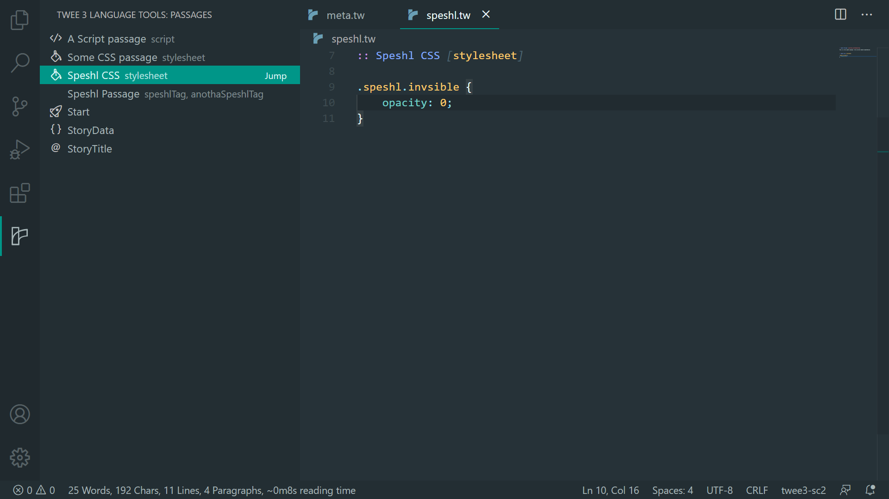
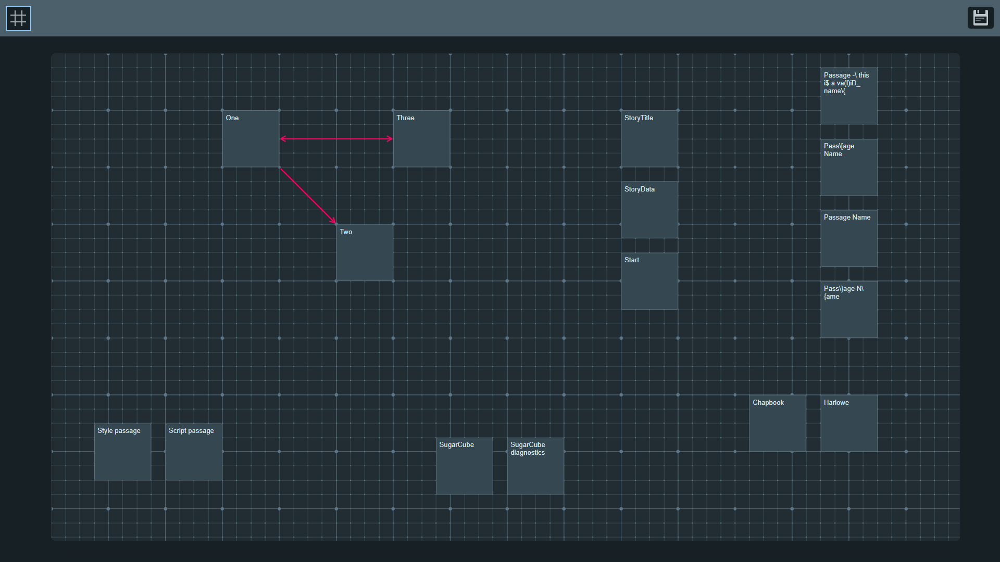
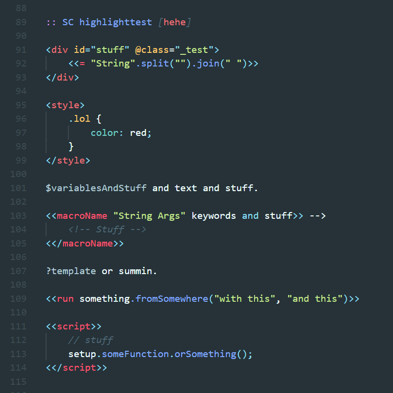
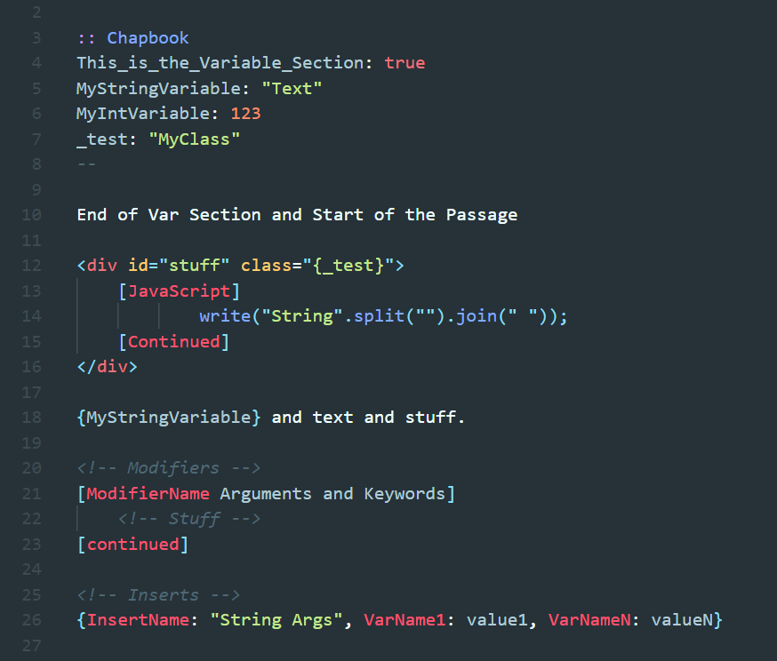
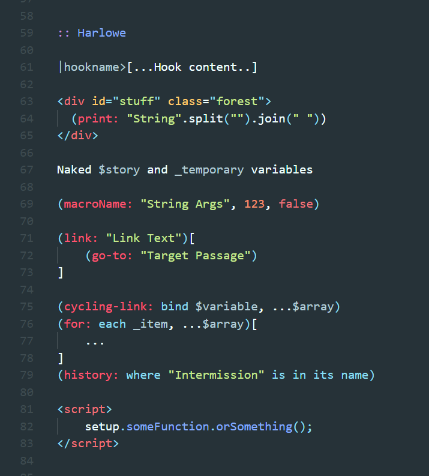

# Twee 3 Language Tools

Syntax highlighting for HTML and select storyformats (see [Features](#features)) on top of Twee 3 code.

Made possible through contributions from:
- [@Goctionni](https://github.com/Goctionni)
- [@MinusGix](https://github.com/MinusGix)
- [@rambdev](https://github.com/rambdev)

And feedback from the folks over at the Twine Games [Discord Server](https://discord.com/invite/n5dJvPp).

---

## **Requirements**

The extension relies on a workspace (or a folder) being open. If single files are to be edited, the storyformat must be configured manually.

Supported file extensions:

- `.tw`
- `.twee`

To set the correct storyformat for the files, a `StoryData` passage with the storyformat (and version) (see example below) mentioned in it is preferred. If not, the extension provides the option to set the format explictly.)

```json
:: StoryData
{
	"ifid": "<ifid here>",
	"format": "<story format here, i.e. 'SugarCube'>",
	"format-version": "<story format version here, i.e. '2.35.0'>"
}
```

---

## **Features**

### Twee
- Syntax highlighting.  

- Snippet to generate the `StoryData` special passage: start typing `StoryData` in a Twee document and press <kbd>Tab</kbd> when prompted with the snippet. This populates the IFID field with a newly generated one.

- Command palette tool to generate IFID: open the command palette (<kbd>Ctrl/Cmd + Shift + P</kbd> or <kbd>F1</kbd> by default) and search for "IFID".  

- A list of passages for quick jumps (can be grouped by files, folders, or passage tags.) Open from the Twee 3 Language Tools tab on the activity bar (the forking paths logo.)  

      

- Workspace statistics Status bar item (WIP) (Contributed by @rambdev).  
	- Total passage count (includes Story passages, Special passages, and Script/Stylesheet-tagged passages)  
	- Story passage count  

- A story-map view (Contributed by @Goctionni) that opens in the browser! Still in *very* early stages. Also accessible from the Twee 3 Language Tools tab on the activity bar.

	- Currently implemented features:  
		- Snap to grid (button on top-left.)  
		- Arrows to linked passages.  
		- Passage position, size, and tags can be edited via a sidebar. Changes are *not* currently autosaved, and a manual save button is present.  
		- Multi-select, and thereby mass editing of position, size, and tags.  
		- Ability to move passages across files.

	- Usage:
		- Use the middle-mouse button, or hold down <kbd>Shift</kbd> while dragging the mouse to pan the map grid.
		- Scroll the mousewheel or stretch/pinch on trackpad to zoom in/out.
		- Hold <kbd>Ctrl/Cmd</kbd> while selecting to add new passages to selection, or remove already added passages from it.

	

### SugarCube
*(id: `sugarcube-2`)*
- Syntax highlighting:  
    
- Macro documentation on hover. (Contributed by @MinusGix) (Custom definitions can be added via `*.twee-config.yml`. See: [Custom macro definitions for SC](#custom-macro-definitions-for-sugarcube)):  
	- [Screenshot - macro documentation](docs/images/sc2-hovertips.png)
- Container macro pair highlights:  
	- [Screenshot - macro pairs](docs/images/sc2-macro-tag-matching.png)
- Snippets. (Contributed by @rambdev) Type macro names to get code snippet inserts with placeholder values:  
	- [Screenshot - snippet](docs/images/sc2-snippets.png)
	- [Screenshot - snippet insert](docs/images/sc2-snippets-insert.png)
	- [Screenshot - wrapping snippets](docs/images/sc2-snippets-wrap.png)
- Diagnostics:  
	- Macros with opening tags but no closes (and vice-versa):  
		- [Screenshot - diagnostics](docs/images/sc2-unclosed-macro.png)
	- Deprecated macros:  
		- [Screenshot - diagnostic](docs/images/sc2-deprecated-macro.png)
	- Deprecated `<<end...>>` closing macros:  
		- [Screenshot - diagnostic](docs/images/sc2-endvariant-macro.png)
		- [Screenshot - quick fix](docs/images/sc2-endvariant-quickfix.png)
	- Unrecognized macros. New/custom macros can be defined manually (see: [Custom macro definitions for SC](#custom-macro-definitions-for-sugarcube)), but anything else will throw a warning. This can be turned off by the `twee3LanguageTools.sugarcube-2.undefinedMacroWarnings` setting:  
		- [Screenshot - diagnostic](docs/images/sc2-unrecognized-macro.png)
		- [Screenshot - quick fix](docs/images/sc2-unrecognized-quickfix.png) (Writes definitions to `t3lt.twee-config.yml` in the root of the first workspace folder.)
	- Invalid argument syntax in macros (Contributed by @MinusGix):  
		- [Screenshot - diagnostics](docs/images/sc2-parameter-validation.png)
	- Argument validation (Contributed by @MinusGix): [Read here](docs/parameters.md) for more information.

### Chapbook
*(id: `chapbook-1`)*
- Syntax highlighting.  
    

### Harlowe
*(id: `harlowe-3`)*
- Syntax highlighting.  
    

---

## **twee-config**

### Custom Macro definitions for SugarCube

The extension adds diagnostics for erroneous usage of macros in TwineScript for the `sugarcube-2` storyformat. By default, only the definitions for the core SugarCube library are present, but custom definitions can be added. The process is as follows:

1. Add a `*.twee-config.yaml` (or `.yml`) **OR** `*.twee-config.json` (`*` represents any valid file name) file to your project folder (or anywhere in the workspace.)
2. Define custom macros as follows:
	- If using `*.twee-config.yaml` (indentation is important for YAML files):
		```yaml
		sugarcube-2:

		  macros:

		    customMacroName:
		      container: true

		    anotherOne: {}
		```
	- If using `*.twee-config.json`:
		```json
		{
			"sugarcube-2": {
				"macros": {
					"customMacroName": {
						"container": true
					},
					"anotherOne": {}
				}
			}
		}
		```
The following properties are currently programmed, even though not all of them are used as of now:
- **name** `(string)` *optional*: Name of the macro (currently unused in code; the name of the object suffices for now.)
- **description** `(string)` *optional*: Description of macro. Shown on hover. Supports markdown.
- **container** `(boolean)` *optional*: If the macro is a container (i.e. requires a closing tag) or not. `false` by default.
- **selfClose** `(boolean)` *optional*: If the macro is a self-closable. Requires macro to be a container first. `false` by default.
- **children** `(string|child-definition array)` *optional*: If the macro has children, specify them as an array of strings or child-definition (WIP) objects.
- **parents** `(string array)` *optional*: If the macro is a child macro, specify the names of its parents as an array (currently unused in code.)
- **deprecated** `(boolean)` *optional*: If the macro is deprecated or not. `false` by default.
- **deprecatedSuggestions** `(string array)` *optional*: If the macro is deprecated, specify any alternatives to the macro as an array.
- **parameters** `(object)` *optional*: Allows for macro argument validation. [Read here](docs/parameters.md) for more information.
- **decoration** `(object)` *optional*: Allows for declaring decorations to be displayed on that macro. Uses [DecorationRenderOptions](https://code.visualstudio.com/api/references/vscode-api#DecorationRenderOptions)' fields. Requires `definedMacroDecorations` setting to be enabled.

**NOTE:** Multiple `twee-config` files can be present in a workspace. They will stack and add to the macro definitions for the workspace. The recommended strategy is to make separate files for separate macro sets/libraries, e.g. (the following file can also be used as an example):
- `click-to-proceed.twee-config.yaml` ([Link](https://github.com/cyrusfirheir/cycy-wrote-custom-macros/blob/master/click-to-proceed/click-to-proceed.twee-config.yaml))

---

## **Experimental Stuff**

### Passage Auto-packer

Uses a simple packing algorithm to space out passages into clusters based on the file they originate from.

To use, search for `Pack passages to clusters` from the command palette (<kbd>Ctrl/Cmd + Shift + P</kbd> or <kbd>F1</kbd> by default).

---

### SugarCube-2: Add All Unrecognized Macros to Definition File

Adds every unrecognized macro to the definition file, instead of doing it one by one.

To use, search for `Unrecognized Macros` from the command palette (<kbd>Ctrl/Cmd + Shift + P</kbd> or <kbd>F1</kbd> by default).

However, it is still recommended to add definitions one at a time.

---

### SugarCube-2: Self-closing macros

***NOTE:*** SugarCube 2 does *NOT* have a self-closing syntax for container macros, this feature is just to support custom passage processing functions.

Example of such a function which replaces self-closed instances with the actual closing macro tag (i.e. `<<macro />>` with `<<macro>><</macro>>`):
```js
Config.passages.onProcess = function(p) {
	const macroNamePattern = `[A-Za-z][\\w-]*|[=-]`;

	const selfCloseMacroRegex = new RegExp(`<<(${macroNamePattern})((?:\\s*)(?:(?:/\\*[^*]*\\*+(?:[^/*][^*]*\\*+)*/)|(?://.*\\n)|(?:\`(?:\\\\.|[^\`\\\\])*\`)|(?:"(?:\\\\.|[^"\\\\])*")|(?:'(?:\\\\.|[^'\\\\])*')|(?:\\[(?:[<>]?[Ii][Mm][Gg])?\\[[^\\r\\n]*?\\]\\]+)|[^>]|(?:>(?!>)))*?)\\/>>`, 'gm');

	return p.text.replace(selfCloseMacroRegex, "<<$1$2>><</$1>>");
};
```

The `twee3LanguageTools.experimental.sugarcube-2.selfClosingMacros.enable` setting enables detection of self-closed macros.

---

## **Known issues**

Argument validation is still a work in progress. Passage name validation, especially. Shouldn't hinder workflow, however.

---

## **Changelog**

Changelog [here](CHANGELOG.md).

---
